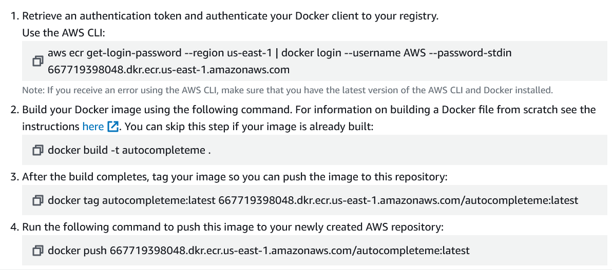

# Deploying Huggingface Rust Transformer to AWS Apprunner

## Description
In this project, we containerize an Actix web application that allows the user to curl request an endpoint with a json payload, which contains a prompt, to receive the a completed version of the prompt inside the payload. In other words, one can ask about a capital and get information about it. The backend is an Actix web framework powered by a small LLAMA model, from Rustformers' Huggingface repository, doing inference. The modelling component of the app was made possible in large part thanks to the [template](https://github.com/AIAnytime/LLM-Inference-API-in-Rust/tree/main) by [AIAnywhere](https://github.com/AIAnytime). This app is then containerized and sent to AWS Elastic Container Registry (ECR), where its image is then deployed via AWS Apprunner, generating a link for public use. That link can be accessed and queried via the curl command in a very specific way , which is detailed below. Unfortunately, I was not successful with deploying on Lambga or Apprunner, as I received timeouts on both ends despite any configuration change that I made.

[Click Here for this Project's Overview Demo Video!!!]()

## Why opt for an autocomplete functionality?

It was a simple and efficient way to use a small language model for an inference task. Also, apprunner resources are small and not that powerful, which necessitated a small model with a relatively shorter inference time.

## Usage

Unsuccessful Deployments Below:

AWS Apprunner Link (Too Slow) : https://d8kitqh5ah.us-east-1.awsapprunner.com/


AWS Lambda Function URL (Even Slower) : https://wzm5hew43wrty45wotghsdvvpi0qwmax.lambda-url.us-east-1.on.aws/


I will deactivate both within a week to reduce expenses.

```
curl -X POST   https://d8kitqh5ah.us-east-1.awsapprunner.com/chat   -H 'Content-Type: application/json'   -d '{"prompt": "JoJos Bizzarre Adventure is"}'
```
At the link, add a "/chat"  and curl it with the prompt after "prompt". What is sent is a json payload that is decoded on the backend and processed by the small language model. The inference is returned as text via the terminal.

## Quick Usage

To use the demo run the code quickly and directly, opt for one of these two options.

With Cargo:

```
# local
make local-run
# In a separate terminal session, run
curl -X POST localhost:8080/chat   -H 'Content-Type: application/json'   -d '{"prompt": "Toy Story sold"}'
```


With Docker:
```
# docker
make local-docker-run
# In a separate terminal session, run
curl -X POST   localhost:8080/chat   -H 'Content-Type: application/json'   -d '{"prompt": "Hey Arnold! was famous for"}'
```


P.S. That is a full hallucination. It's off.

## Pre-requisites
For those not using the AWS Cloud 9 environment, the required setup will be installing the following:

* AWS cli (the most recent version) (regardless of environment, necessary for Lambda and Apprunner Deployment)

* Add the permissions to the IAM User/Role for the cloud instance or developer environment. One that is not shown in the images is only relevant if you plan to deploy on AWS Lambda (AWSLambdaFullAccess Permission).

    * For the IAM user, I opted for this combination of permissions. The codedeploy ones are likely not necessary, but I didn't test that case.
    
    

    * For the AWS Cloud 9 role attached to the instance, I chose these permissions.

    

## Setup Instructions

1. Make a directory for the project and navigate inside it.
```
$ cargo new your_project
$ cd your_project
```

2. Add the logic to complete inference. Pay special attention to the model in use. It is expected to be locally available.
```
// ellided code (...) to focus on the llm

async fn infer(prompt: String) -> Result<String, Box<dyn Error>> {
    let tokenizer_source = TokenizerSource::Embedded;
    let model_architecture = ModelArchitecture::Llama;
    let model_path = PathBuf::from("open_llama_3b-q4_0-ggjt.bin");
    let model = llm::load_dynamic(
        Some(model_architecture),
        &model_path,
        tokenizer_source,
        Default::default(),
        llm::load_progress_callback_stdout,
    )?;

    let mut session = model.start_session(Default::default());
    let mut generated_tokens = String::new();

    let res = session.infer::<std::convert::Infallible>(
        model.as_ref(),
        &mut rand::thread_rng(),
        &llm::InferenceRequest {
            prompt: (&prompt).into(),
            parameters: &llm::InferenceParameters::default(),
            play_back_previous_tokens: false,
            maximum_token_count: Some(140),
        },
        &mut Default::default(),
        |r| match r {
            llm::InferenceResponse::PromptToken(t) | llm::InferenceResponse::InferredToken(t) => {
                generated_tokens.push_str(&t);
                Ok(llm::InferenceFeedback::Continue)
            }
            _ => Ok(llm::InferenceFeedback::Continue),
        },
    );
```

3. Make the model easily accesible for the Dockerfile by storing it on S3 and making it public with ACL.


4. Here is how the docker file is used in this context. The trick is in the ADD line, where the publicly exposed model, [downloaded from Huggingface](https://huggingface.co/rustformers/open-llama-ggml/blob/main/open_llama_3b-f16.bin), is shown.
```
FROM rust:latest as builder
ENV APP infermp10
WORKDIR /usr/src/$APP
COPY . .
RUN cargo install --path .

# Use the testing debian
FROM debian:testing
RUN apt-get update && rm -rf /var/lib/apt/lists/*
COPY --from=builder /usr/local/cargo/bin/$APP /usr/local/bin/$APP

# Copy the database file into the container
ADD https://vgexo.s3.us-west-1.amazonaws.com/open_llama_3b-q4_0-ggjt.bin /

# Export this Actix web service to port 8080 and 0.0.0.0
EXPOSE 8080
CMD ["infermp10"]
```

5. Run locally to test that it works.
```
$ cargo build && cargo run
# In separate session
$ curl -X POST   localhost:8080/chat   -H 'Content-Type: application/json'   -d '{"prompt": "Rust is"}'
```


6. Run with docker to test as well. Build the image and run the image in the same session, while "curling" it in another.
```
$ docker build -t autocomplete_actix .
$ docker run -it --rm -p 8080:8080 autocomplete_actix
$ curl -X POST   localhost:8080/chat   -H 'Content-Type: application/json'   -d '{"prompt": "Final Fantasy draws from so many cultures like"}'
```
Docker Output:


7. (Optional) Deploy the app to Apprunner and/or Lambda. For Apprunner, configure an ECR repository in AWS (very straightforward, use private registry), look for the push commands for your repository, then appropriately push the image to the repository. I put my sequence of commands as a "make deploy-aws". Unfortunately, I was not successful, as I got upstream server errors, despite using the highest cpu configuration on the Apprunner instance.




```
deploy-aws:
	aws ecr get-login-password --region us-east-1 | docker login --username AWS --password-stdin 667719398048.dkr.ecr.us-east-1.amazonaws.com
	docker build -t autocompleteme .
	docker tag autocompleteme:latest 667719398048.dkr.ecr.us-east-1.amazonaws.com/autocompleteme:latest
	docker push 667719398048.dkr.ecr.us-east-1.amazonaws.com/autocompleteme:latest
```

8. For AWS Lambda, I deployed the ECR image directly from the prior step and increased the available memory and wait time. Unfortunately, timeout errors also followed. 


## Result

With Cargo:


With Docker:


## Licenses
Creative Commons.

## Status
This project is complete as of April 2024.
